# Tài liệu về Portal

## I. Giới thiệu về Portal

- "Portal" là một giải pháp phần mềm quản lý tài nguyên giáo dục, được phát triển trên nền tảng mã nguồn mở Odoo, chuyên biệt trong quản lý và điều hành các hoạt động giáo dục tại FUNiX. Mục tiêu của "Portal" là đảm bảo quá trình vận hành trong lĩnh vực giáo dục diễn ra một cách mượt mà và không gián đoạn.

- Nhờ vào kiến trúc module hóa linh hoạt của Odoo, "Portal" không chỉ có khả năng tích hợp và mở rộng mạnh mẽ, mà còn cho phép tùy chỉnh sâu rộng, mang lại một giải pháp quản lý tài nguyên giáo dục cực kỳ hiệu quả cho doanh nghiệp.

## II. Hệ thống quản lý tài nguyên giáo dục Portal

- Để đáp ứng được nhu cầu quản lý của doanh nghiệp, đội ngũ developer đã phát triển các module nghiệp vụ chính như sau:

<table style="width: 100%;">
    <thead>
        <tr>
            <th>STT</th>
            <th colspan="2">Tên Module</th>
        </tr>
    </thead>
    <tbody>
        <tr>
            <td>1</td>
            <td>Portal Student Management</td>
            <td>Module quản lý học viên</td>
        </tr>
        <tr>
            <td>2</td>
            <td>Course Management</td>
            <td>Module quản lý các khóa học</td>
        </tr>
        <tr>
            <td>3</td>
            <td>Learning Program</td>
            <td >Module quản lý các chương trình học</td>
        </tr>
        <tr>
            <td>4</td>
            <td>Mentor Management</td>
            <td>Module quản lý các Mentor</td>
        </tr>
        <tr>
            <td>5</td>
            <td>Student Organization Management</td>
            <td>Module quản lý doanh nghiệp</td>
        </tr>
        <tr>
            <td>6</td>
            <td>Feedback Ticket Management</td>
            <td>Module quản lý feedback của học viên</td>
        </tr>
        <tr>
            <td>7</td>
            <td>Project</td>
            <td>Module quản lý các bài Project của học viên</td>
        </tr>
    </tbody>
</table>

- Ngoài các module nghiệp vụ kể trên, các developer còn phát triển thêm những **utility module** để phục vụ nghiệp vụ vận hành:

<table >
    <thead>
        <tr>
            <th>STT</th>
            <th colspan="2">Tên Module</th>
        </tr>
    </thead>
    <tbody>
        <tr>
            <td>1</td>
            <td>Mail Service</td>
            <td>Module Dịch Vụ Mail</td>
        </tr>
        <tr>
            <td>2</td>
            <td>Service Key</td>
            <td>Module quản lý các key nội bộ</td>
        </tr>
    </tbody>
</table>

Đây là các module nghiệp vụ chính của Portal, nhưng để chạy được các module này trên nền tảng Odoo, chúng ta sẽ phải cài thêm vào các module có sẵn của Odoo. Danh sách các module hiện có ở [Staging Portal](https://staging-portal.funix.edu.vn/web) có thể xem [Tại đây](../assets/1.Module_list/Module_list_ir.module.module.xlsx) (File Excel - Cập nhật ngày 27/11/2023)

Sau khi cài đặt các module cần thiết xong, chúng ta sẽ phải chỉnh sửa / tùy biến thêm các service_key ở Menu > Setting Config sau đây:

1. LMS_BASE : Đường dẫn đến server LMS
   
   ví dụ: https://test-xseries.funix.edu.vn/ 

2. LMS_PUSH_GRADE_URL: Đường dẫn đến api endpoint để submit bài chấm project ở LMS
   
   Ví dụ: https://test-xseries.funix.edu.vn/api/funix_portal/project/grade_project (**SỬ DỤNG LMS_BASE + endpoint**)

3. MAIL_SERVICE : api key của mail service (sendgrid)

4. SLA_TICKET_REMINDER_TIME_IN_DAY : Gửi Email nhắc nhở staff xử lý ticket trước N ngày

5. SLA_MENTOR_REMINDER_TIME_IN_DAY : Gửi Email nhắc nhở mentor xử lý trước N ngày và cứ sau N ngày là sẽ gửi email nhắc nhở.

# III. Chức năng của các Module

Mỗi module sẽ có các thành phần chính sau đây:

1. Các vai trò của User (User Role hay User Group)

2. Phân quyền của User Group, bao gồm các quyền liên quan đến Create (Tạo), Read (Đọc), Update (Sửa), Delete (Xóa).
   
   - Create: User có quyền khởi tạo các record ở các table thuộc module.
   
   - Read: User có quyền đọc các record ở các table thuộc module.
   
   - Update: User có quyền chỉnh sửa thông tin các record ở các table thuộc module.
   
   - Delete: User có quyền xóa đi record ở các table thuộc module

3. Các tính năng của module

4. TODO list: Các thành phần phải chỉnh sửa của module để đáp ứng yêu cầu nghiệp vụ

## 1. Module Student Management

- Bảng phân quyền module
  1. **Admin**
  
  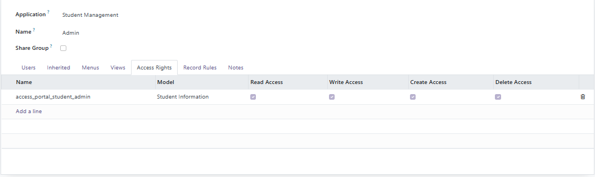
  
  2. **Teacher**
  
  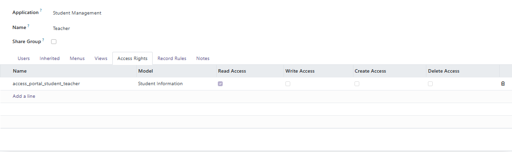

- Tính năng của module:
  
  1. Hiển thị danh sách Student có trong hệ thống
  
  2. Hiển thị thông tin chi tiết của một Student
  
  3. Có thể enroll học viên vào các khóa học
  
  4. Có thể assign học viên vào một tổ chức
  
  5. Đồng bộ dữ liệu Student ở Portal và LMS khi khởi tạo một student ở hai bên.

**TODO:**

- Chỉnh sửa lại mối quan hệ Organization - Student thành **one2many**

- Giới hạn các course mà student có thể đăng ký dựa vào số lượng course mà Organization đã mua.

- Đồng bộ schema với LMS để đảm bảo data integrity

- Không cho tạo Organization và Course mới khi đang ở trong giao diện Student Form

- Cần tích hợp với API delete student ở LMS và xem xét đồng bộ khi thực hiện Delete

- Tạo chế độ local mode dựa vào debug flag => không gửi api lên LMS khi ở chế độ này

- Thiếu API để thực hiện Read, Update, Delete để LMS gọi vào

- Define lại bảng phân quyền

## 2. Module Course Management

- Bảng phân quyền
1. **Admin**

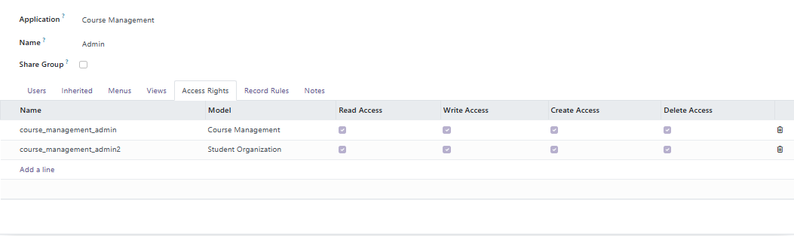

1. **User**

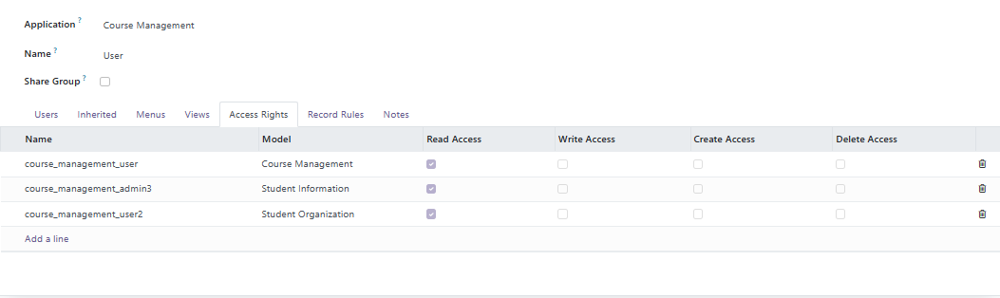

- Tính năng của Module:
  
  1. Hiển thị danh sách các khóa học có trong hệ thống
  
  2. Hiển thị thông tin chi tiết khóa học
  
  3. Có thể enroll học viên vào khóa học và có API enroll / unenroll để tích hợp với LMS để đồng bộ enroll / unenroll khóa học
     
     => Khi enroll / unenroll ở LMS thì sẽ gọi API đến Portal để thực hiện enroll / unenroll ở Portal
     
     => Khi enroll / unenroll ở Portal thì sẽ gọi API đến LMS để thực hiện enroll / unenroll ở LMS
  
  4. Có thể chỉnh sửa danh sách các Organization đã mua khóa học

**TODO**:

- Làm rõ lại vai trò phân quyền

- Không cho tạo Organization và Student mới khi đang ở giao diện Course Management

- Tích hợp Schema mới (liên quan đến Learning Program và Student)

- Tạo chế độ local mode dựa vào debug flag => không gửi api lên LMS khi ở chế độ này

- Tích hợp API với bên LMS đồng bộ việc thêm danh sách Organization ở hai bên ở trong giao diện Module Course_Management ??? (cần test)

- Thiếu API thực hiện CRUD để bên LMS có thể gọi vào

- Define lại bảng phân quyền

## 3. Module Student Organization

- Bảng phân quyền
1. **Admin**

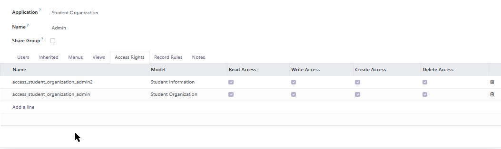

2. **User**

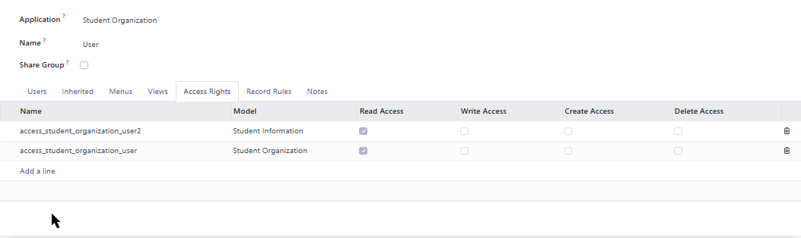

- Tính năng của Module:
  
  1. Hiển thị danh sách Tổ chức trong hệ thống
  
  2. Hiển thị thông tin chi tiết của các tổ chức bao gồm
     
     - Danh sách Student có trong tổ chức
     
     - Danh sách các Course mà tổ chức đã mua

**TODO**

- Làm rõ lại vai trò phân quyền

- Thiếu API CRUD để LMS có thể gọi vào 

- Viết API remove student from organization

- Test khả năng đồng bộ data khi add / remove student ở Organization

- Phải thêm logic khi thực hiện create / write Org thì sẽ gọi API bên LMS để đồng bộ

- Tạo chế độ local mode dựa vào debug flag => không gửi api lên LMS khi ở chế độ này

- Define lại bảng phân quyền

## 4. Module Mentor Management

- Bảng phân quyền
1. **Admin**

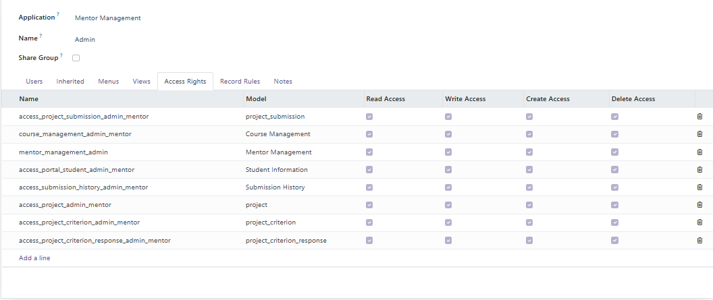

1. **Mentor**

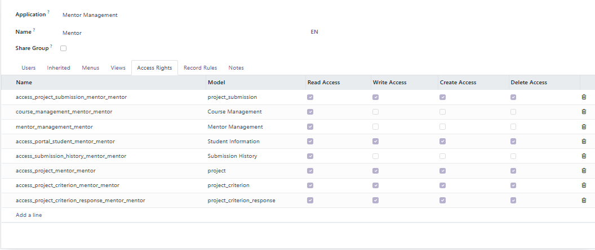

*Chú thích:* Module Learning Project bao gồm các model sau:

- project_submission

- submission_history

- project

- project_criterion

- project_criterion_response

- Tính năng của module:
  
  1. Hiển thị danh sách Mentor trong tổ chức
  
  2. Các mentor được liên kết với Odoo User, có nghĩa là khi tạo mentor mới ở module thì một odoo user cũng được tạo ra và có các quyền của mentor
     
     => Khi tạo một mentor mới với email có sẵn trong hệ thống Odoo User => Tự động thêm role Mentor vào User đó
  
  3. Hiển thị thông tin chi tiết của Mentor bao gồm:
     
     - Các khóa học Mentor đang phụ trách (có thể chỉnh sửa)
     
     - Các Project Submission mà mentor đang đảm nhiệm (có thể chỉnh sửa)
  
  4. LMS có thể gọi API tới Portal để lấy thông tin của một Project Submission
  
  5. LMS có thể gọi API tới Portal để lấy danh sách các submission theo course_id
  
  6. Mentor và Admin ở tab Awaiting Submission có thể nhìn thấy các Project Submission có trạng thái là not_graded
  
  7. Mentor và Admin ở tab Tracking Submission có thể nhìn thấy tất cả trạng thái (not_submitted, submitted, submission_failed, submission_cancelled, grading, graded,...) ,của tất cả Project Submission **và có thể edit chúng (CẦN FIX)** 
  
  8. Admin có thể chỉnh thời gian SLA interval để gửi mail ngay ở trong module này

**TODO**

- Làm rõ lại vai trò phân quyền

- Nếu LMS có lưu thông tin Mentor => viết API CRUD để LMS có thể gọi vào

- Chỉnh sửa lại Logic hiển thị ở Awaiting Submission và Tracking Submission
  
  1. Đối với Mentor: Mentor chỉ có thể thấy được các Awaiting Submission thuộc các Course mà họ phụ trách. Và ở tab Tracking Submission, họ cũng chỉ thấy được các submission mà họ được giao
  
  2. Đối với Admin: Admin có thể thấy hết tất cả như ban đầu

- Cân nhắc lấy view hiển thị Tracking Submission giống như tab Submission ở Module Project Management (tức là hiển thị trạng thái mới nhất của Submission), bởi vì nếu hiển thị tất cả trạng thái của submission ở list view:
  
  => Danh sách sẽ rất dài (1 Submission có thể có tới 3-4 rows) 
  
  => Nếu mục đích là để check trạng thái thì trong view detail có thể thêm vào panel Log ghi lại các mốc thời gian chuyển status thay vì hiển thị hết tất cả ở list view

## 5. Module Learning Program

- Bảng phân quyền

1. Admin

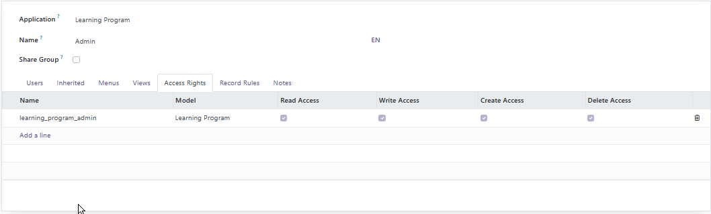

2. User

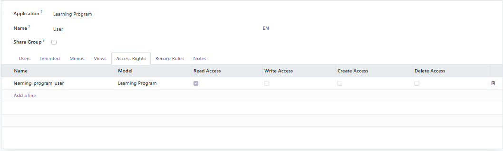

- Hiện tại module learning program chưa chỉnh sửa để adapt với schema customize lộ trình học cho từng học viên, vì vậy sẽ cần phải chỉnh sửa module này

**TODO**

- Tạo ra bảng trung gian để liên kết student, learning program và course (bên LMS cũng sẽ phải phải adapt schema như vậy)

- Viết API CRUD learning program để LMS có thể call vào

- Tích hợp API của bên LMS dữ liệu được đồng bộ 2 cả hai bên

- Làm rõ vai trò phân quyền

## 6. Module Feedback Ticket Management

- Bảng phân quyền

1. Admin 

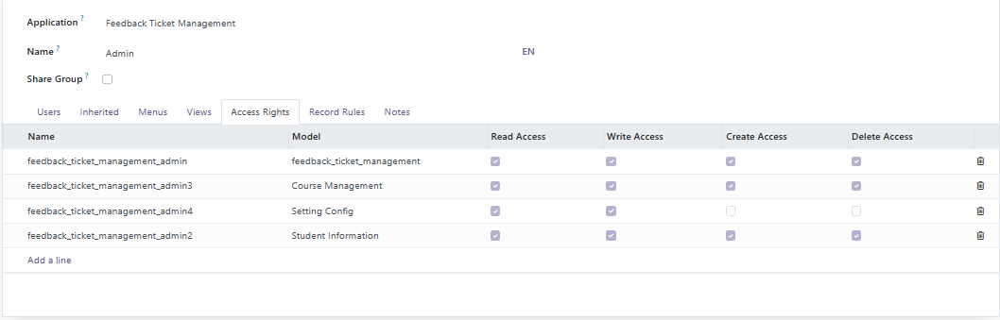

2. Staff

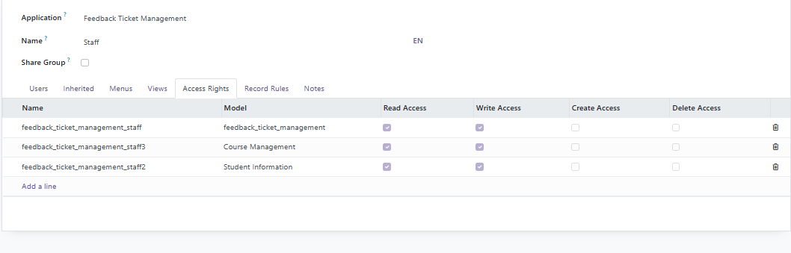

# IV. Chức năng các Module bổ trợ

## 1. Module Service Key

| STT | Group      | Perm_read | Perm_write | Perm_create | Perm_delete |
| --- | ---------- | --------- | ---------- | ----------- | ----------- |
| 1   | Super User | yes       | yes        | yes         | yes         |
| 2   | Admin      | yes       | no         | no          | no          |
| 2   | User       | yes       | no         | no          | no          |

- Tính năng của Module:
  
  1. Có thể lưu trữ giá trị của các key như email_service_api_key, LMS_BASE url ở menu Setting Config. Các giá trị này sẽ được lưu trữ ở một table trong database và có thể truy cập được trong Odoo application
  2. Các key này có thể toggle chế độ private => Chỉ có super user là có khả năng nhìn thấy được các key private và có quyền chỉnh sửa chúng
  3. Hiện tại Admin và User chỉ có thể thấy được các key không private, không thể chỉnh sửa được các key này.

**TODO**

- Chỉnh sửa lại phân quyền của module này
  
  - Super User có thể chỉnh sửa tất cả các key kể cả private
  
  - Admin có thể chỉnh sửa các key public nhưng không thể chỉnh sửa hay nhìn thấy được các key private
  
  - Group User có thể remove hoặc chỉ nhìn thấy được các key public

## 2. Module Mail Service

Dùng để cấu hình mail server. Hiện tại đang có 3 mail server trong Portal

1. Module mail_service: Dùng để cấu hình cho Sendgrid

2. Module email_server_config: Dùng để cấu hình cho cho mail server của anh Vũ (khi mới tìm hiểu về mail server)

3. Module feedback_ticket_management: Trong module này có một cấu hình mail server của google

=> Chi tiết của các mail server này có thể tìm thấy ở giao diện Portal: Tài khoản Admin => Settings => Technical => Outgoing Mail Server

Email Templates: Các module Feedback Ticket Management và Learning Project có các email template đã được code sẵn. 

=> Chi tiết các template hiện có trong Portal, người vận hành có thể thêm hoặc xóa đi Template: Tài khoản Admin => Settings => Technical => Email Templates 

**TODO**

- Thay vì hiện trạng là đang setup ba mail server, xem xét chỉ giữ lại hai mail server config: 1 của sendgrid (để thực hiện ở môi trường dev và staging), 2 của gmail (để thực hiện ở môi trường local)

- Hiện tại thì email reminder để nhắc nhở Mentor chấm bài chưa có tạo ra một Email Template ở trong Odoo, mà tất cả nội dung của mail này được code bên trong module (models/submission_history.py)
