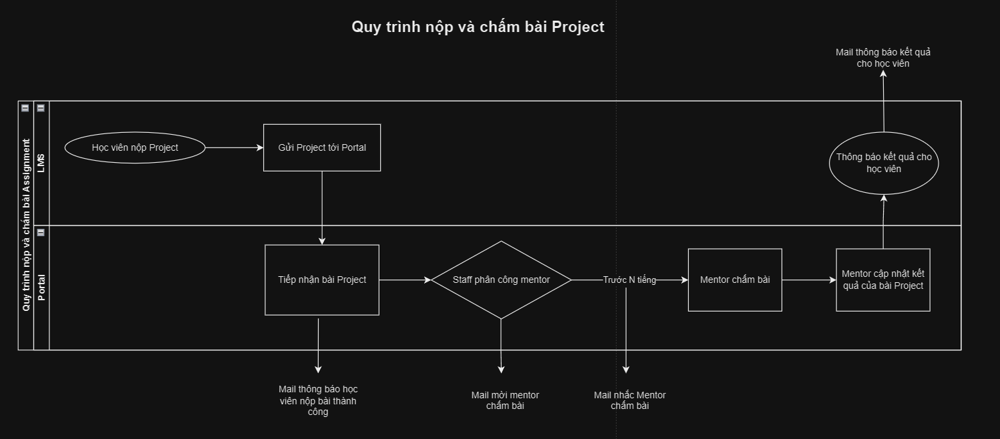
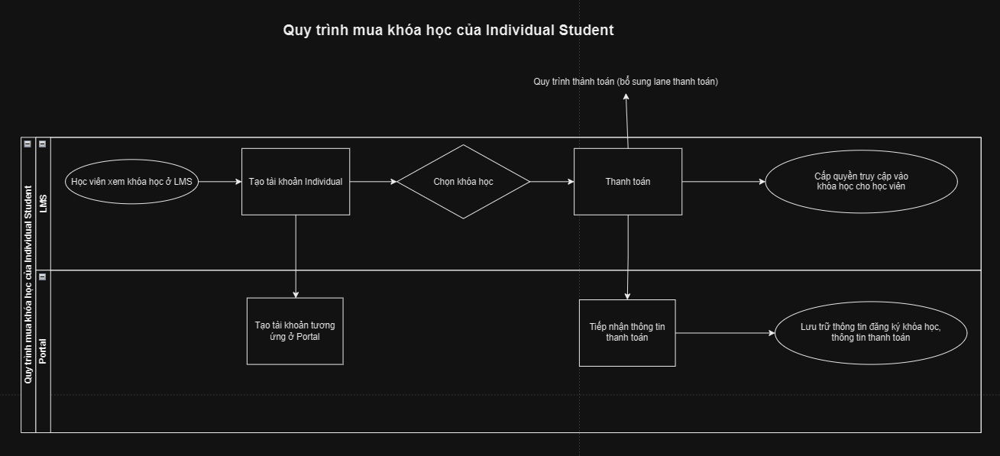
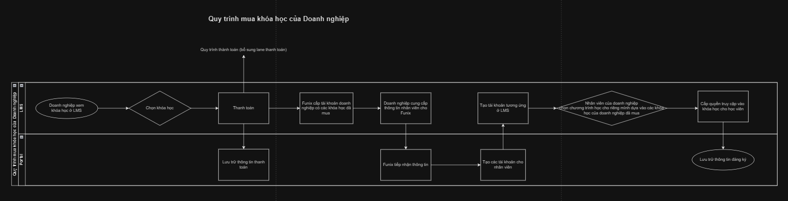
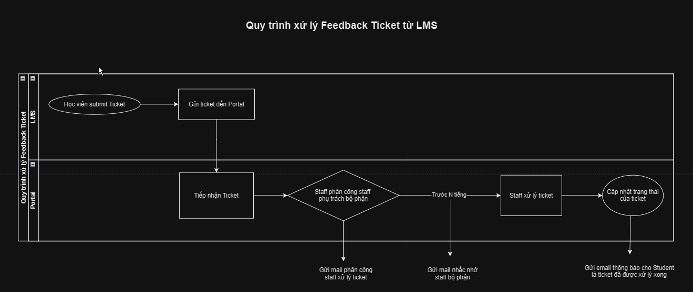

# Bussiness Operation Diagram

Sau đây là sơ đồ overview các quy trình chính giữa LMS và Portal. Các quy trình này sẽ được cập nhật và chỉnh sửa liên tục để phù hợp với yêu cầu doanh nghiệp.

Tất cả sơ đồ quy trình có thể tìm thấy [TẠI ĐÂY](https://drive.google.com/file/d/1AXBw_ewzdQzoJnYit2YDHxyVsHoBYSRF/view?usp=sharing) (Chỉ có tài khoản FUNiX mới xem và chỉnh sửa được nội dung)

**Chú thích:**

- Sơ đồ được chia thành 2 lane: LMS và Portal

- Mũi tên đi qua dải phân cách giữa 2 lane tượng trưng cho việc giao tiếp thông qua API

## 1. Quy trình nộp và chấm bài Project

**Giải thích quy trình:**

1. Học viên nộp bài Project ở LMS

2. Gửi Project từ LMS tới Portal thông qua API endpoint có sẵn ở Portal (ở module Learning Project)

3. Nếu phản hồi gửi về từ Portal thành công, sẽ gửi email cho Student thông báo nộp bài thành công

4. Phân công Mentor để chấm bài => Gửi mail mời mentor chấm bài

5. Nếu trước thời gian N giờ (hoặc ngày) mà mentor chưa chấm xong => Gửi mail nhắc nhở và cứ tiếp tục gửi mail nhắc nhở sau N giờ / ngày

6. Mentor sau khi chấm bài xong cập nhật kết quả bài Project ở Portal và ấn Submit để gửi kết quả thông báo đến học viên

## 2. Quy trình mua khóa học của Individual Student

**Giải thích quy trình:**

1. Học viên xem khóa học ở LMS và tạo tài khoản => Bên Portal sẽ tạo tài khoản student tương ứng

2. Sau đó học viên chọn khóa học và thanh toán (bổ sung lane thanh toán sau)

3. Ở Portal sẽ ghi nhận thông tin thanh toán

4. Lưu trữ thông tin đăng ký khóa học

## 3. Quy trình mua khóa học của Business Student

**GIải thích quy trình**

1. Doanh nghiệp tìm hiểu về các khóa học của Funix thông qua các kênh truyền thông, marketing và trên LMS

2. Doanh nghiệp sẽ chọn ra các khóa học để đào tạo nhân viên của họ

3. Doanh nghiệp sẽ tiến hành thanh toán, Portal sẽ lưu thông tin thanh toán của doanh nghiệp

4. Portal sẽ lưu thông tin doanh nghiệp vào Portal (Module Student Organization) và các khóa học mà doanh nghiệp đã mua

5. Doanh nghiệp cung cấp cho Funix danh sách Student (nhân viên) của doanh nghiệp ở dạng file excel hay spreadsheet

6. Funix sẽ dùng file spreadsheet cung cấp bởi doanh nghiệp để khởi tạo hàng loạt các account student thuộc Organization

7. Những Student này đã có thể truy cập vào danh sách các khóa học mà doanh nghiệp đã mua

8. Student có thể tự tạo ra các learning program của riêng mình dựa vào danh sách các khóa học đó và có thể enroll các khóa học tùy ý trong danh sách

9. Khi Student enroll thì ở Portal và LMS sẽ lưu trữ thông tin enroll của học viên và lưu lại.

## 4. Quy trình giải quyết Feedback Ticket từ LMS

**Giải thích quy trình**

1. Từ LMS, học viên sẽ submit feedback ticket để phản ánh các nội dung hay lỗi kỹ thuật của website

2. Ticket sau đó sẽ được gửi về bên Portal và sẽ được assign cho một Staff phụ trách bộ phận chuyên môn đó.=> Gửi email cho staff

3. Trước N ngày / giờ, nếu ticket vẫn chưa được giải quyết xong, sẽ có email để nhắc nhở staff giải quyết ticket

4. Sau khi staff xử lý xong ticket, họ sẽ cập nhật trạng thái của ticket và hệ thống sẽ gửi email tới Student thông báo ticket đã được giải quyết

**Nghiệp vụ bổ sung**

Trong nhiều trường hợp, ticket sẽ không được khởi tạo trực tiếp ở LMS mà thông qua các kênh support channel như Zalo, Facebook group,.... Trong trường hợp này, ở Portal sẽ phải tạo một ticket để giải quyết những yêu cầu riêng của doanh nghiệp và sẽ gửi email thông báo tới email đại diện của doanh nghiệp sau khi ticket đã được giải quyết.
